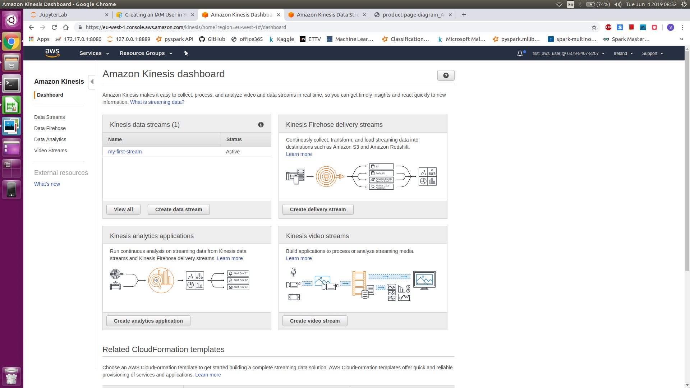
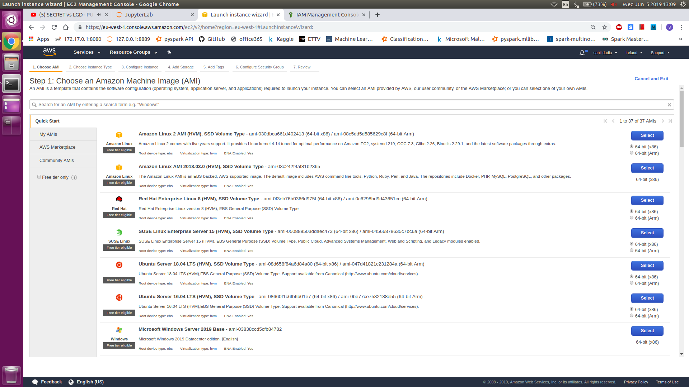
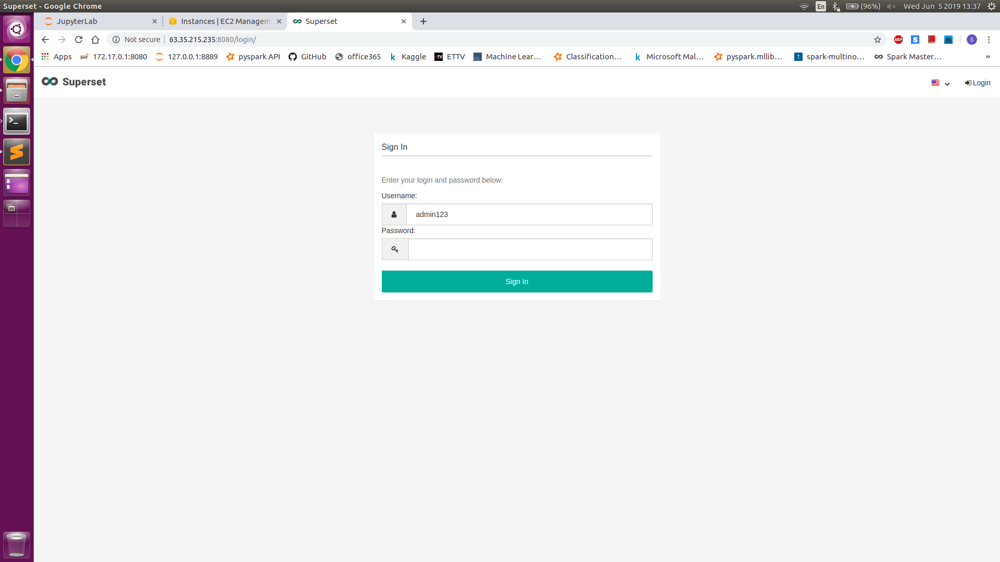

# AWS Workshop

There are 2 parts for this workshop. Part 1 is introduction and basic setup. [Part 2](https://github.com/sdadia/automating_e_commerce) is creating a real time streaming platform.

## Prerequisites

* We expect you have an AWS account. If not,  you can sign up for the first time and for the first 12 months most services are free. Sign up on [AWS](https://portal.aws.amazon.com/billing/signup#/start), you will need credit card information.

* We expect the you to be working with **Linux or Mac**.

* Experience working with Python, pip, jupyter notebook, PgAdmin. Install pgadmin for [Ubuntu](https://tecadmin.net/install-pgadmin4-on-ubuntu/) and [Mac](https://www.postgresql.org/ftp/pgadmin/pgadmin4/v4.8/macos/)

## Part 1 : AWS Basics

In this workshop we will look at setting up the following technologies in chronological order,

* AWS IAM user and AWS configure command line utility
* S3 buckets
* RDS - postgres
* Kinesis Data Stream
* Kinesis Firehose
* AWS Lambda Functions
* EC2 and security group for SuperSet


### AWS IAM User

IAM user are like ID card equivalent of real world. They just show who you are and what you can do (**Permissions**). We will create a user with name *first_time_aws_user* with **ADMIN Privilages**.

#### Procedure create IAM user

Go to top right corner click on your name, then select my security credentials.


Select Get started with IAM users.


On top left, select the Add User button in blue.


Give a user name, and select the options as shown in the picture, click Next.


Click on create group


Give your group a name, and select the Administrator privilages, click create group.


Give your group a name, and select the Administrator privilages, click create group, click Nest


Review the information and click Create user.


Click on the download .csv buttom and we save the file to secure location.


Now Log out of the account from the top right corner by selecting it under your name. Open the credentials file and check the contents. At the end you will be give the login link page, use this link for future use cases.

### AWS Configure Command Line Utility

At times we will eexcute some commands from terminal, without using the webiste console. In order to do that, we need set up the credentials so the commands can login on our behalf.

#### Procedure to configure command line

Open up terminal and install the **awscli** and **boto3** library, verify the installation using the --version command.
```
pip install awscli boto3 --user
aws --version
```
Now we can configure the credentials using the following command
```
aws configure
```
Enter the access key and secret key from the credentails file we downloaded in previous section.
Write the region as *eu-west-1* and output format as *json*


### S3 Buckets

 

They are storage options, like google drive where you can put anything you want.

#### Procedure to create a bucket (Console)
In the find service search S3 select the first option


Click on Create Bucket on top left, give your bucket a name, make it unique, and select the region as EU (Ireland), click create


Click on the bucket, select blue upload buttom on the top left, drag and drop the files you want.


### Postgres RDS

RDS is a service for managed (maintained-backup, storage, update etc) databases -  Oracle, Postgres, Mysql, Microsoft Sql Server, Aurora.

#### Procedure to create Postgres RDS (Console)
Go to home page and search for RDS, select the first option, you should land on this page, Select the create database


Select Postgres and at the bottom check the *Only eligible for free tier*


Scroll to the bottom, in the Settings section, type your instance name, type a good username and password, click next


In the Network and Security section, select publically accessible, In the Database Options, delete anything that is box, go to the end of the page and click next.


Click on view Instances, after 5 minutes, the database will be ready


### Kinesis Data Stream and FireHose

Amazon Kinesis Data Streams (KDS) is a massively scalable and durable real-time data streaming service. KDS can continuously capture gigabytes of data per second from hundreds of thousands of sources such as website clickstreams, database event streams, financial transactions, social media feeds, IT logs, and location-tracking events.


#### How to create Kinesis Stream (Console)
In the find service search Kinesis and select the first option


Select blue button called get started on center of the page


Click on create data stream


Give your stream a name, select the number of shards as 1, click on create stream. 


In 30 seconds you will have created a stream.


#### How to connect this stream to S3 bucket using Firehoses?

In the find service search Kinesis again, Click on create delivery stream


Give your stream a name, select source as kinesis stream, select the stream we just created from the drop down option, click next


Leave everything as default option, click next


In the Select destination click on S3, and choose the s3 buckt we created in the drop down menu, click next.


Type buffer interval as 60, at bottom, choose create new IAM role, it will open a new window


Leave everything defualy and click allow


Review the details and click on create stream, After 1 minute the delivery stream will be ready


#### Let's send some data to the kinesis stream

Create a new file/jupyter notebook and past the code, also change the **StreamName** value to your streamName in the last line. After one minute check the S3 bucket for a newley created file.

```python
# Save this File as : sample_producer.py
import boto3
import json

kinesis_client = boto3.clinet("kinesis", region='eu-west-1')

data = {'store_id': 13
        'transaction_id': 1234,
        'sale': 15,
        'item': ["apples", "plums", "grapes", "oranges", "beans"]
       }

# send the record
kinesis_client.put_record('Data':json.dumps(data) + "\n", # convert to json before sending the data
                          'PartitionKey': data['city'], 
                          StreamName='my-first-stream')   # change me
```


### AWS Lambda Function

AWS Lambda is a compute service that lets you run code without provisioning or managing servers. AWS Lambda executes your code only when needed and scales automatically, from a few requests per day to thousands per second. You pay only for the compute time you consume - there is no charge when your code is not running.


#### Procedure to create a Lambda Function (Console)

Come to home page and search for lambda in the service section. Click on create function button.


Give your functiona name, select the runtime as python, Create a role from the IAM console, select create function


On the left side add the S3 trigger from the list


Scroll down and select the bucket from where we will take the files, in the event type select PUT, click ADD at the bottom


Scroll top and click the save buttom on the top right corner.


Now we have created the lambda function, and we can start writing the code. Select the function name near the layer, scroll bottom. In this screen you can write your code.


### AWS EC2 and Security groups

Amazon Elastic Compute Cloud (Amazon EC2) is a web service that provides secure, resizable compute capacity in the cloud. It is designed to make web-scale cloud computing easier for developers. Amazon EC2’s simple web service interface allows you to obtain and configure capacity with minimal friction.

#### Launch a EC2 machine

Come to homepage and search for EC2, click in launch Instance


Select ubuntu 18.04 from the list, click on select


Select t2-micro from the list and click on review and launch


Review the details and click on launch


This will prompt to download a keypair, choose, create a new key pair, and give you kep pair a name and click on download key pair, then click on launch instance. After 1 minute you have a EC2 machine on the cloud.


### Setup Security Group

If you have worked in a company, you need to open specific ports for connection. Security groups tells which ports are open and for which IP addrees. We will run superset on port 8080, so we need to open that port. Currently only port 22 is open, which we need for SSHing into the remote computer. Click on the EC2 machine, in the description section, click on inbound rules. This will show the ports which are open.


Besides this, click on launch-wizard-xx, so we can configure the security settings, on the bottom of the page, go to the Inbound Tab. Here we can see only SSH is enabled, so we will edit this and add port 8080.


Click on ADD rule, select custom TCP, in the port put 8080, select source as anywhere, as we want to access the superset website from anywhere. Put descritin as shown. Click Save


#### Install superset

Lets install superset on the machine

```bash
# dependencies
sudo apt update &&  sudo apt-get install -y build-essential libssl-dev libffi-dev python3-dev python3-pip libsasl2-dev libldap2-dev
sudo pip3 install pandas==0.23.4 SQLAlchemy==1.2.2 psycopg2-binary pymssql superset

# one time setup
export FLASK_APP=superset
flask fab create-admin  --username admin123 --password admin1234 --firstname admin --lastname admin --email admin@gma.com
superset db upgrade 
superset init

# start superset
superset runserver -p 8080
```

Find public IP of your machine and go to this website

public-IP:8080
    
Login ID : admin123
    
Password : admin1234

Public IP from the description


